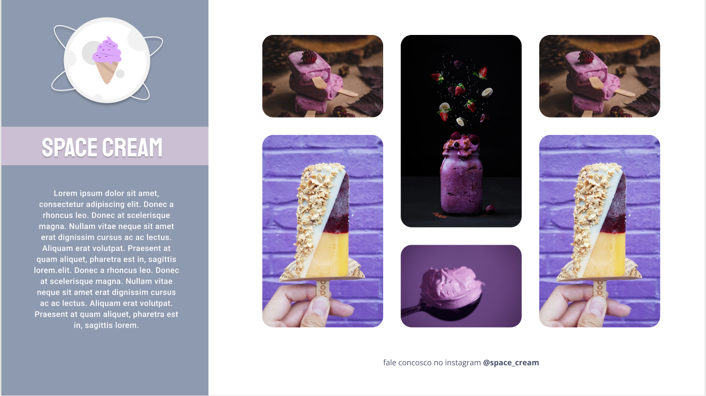

<h1 align="center"> Space Cream </h1>

Aplicação desenvolvida no Stage 03 do programa Explorer da Rocketseat.

  <a href="#-tecnologias">Tecnologias</a>&nbsp;&nbsp;&nbsp;|&nbsp;&nbsp;&nbsp;
  <a href="#-projeto">Projeto</a>&nbsp;&nbsp;&nbsp;|&nbsp;&nbsp;&nbsp;
  <a href="#-layout">Layout</a>&nbsp;&nbsp;&nbsp;|&nbsp;&nbsp;&nbsp;
  <a href="#memo-licença">Licença</a>

  

 

  

## 🚀 Tecnologias

Esse projeto foi desenvolvido com as seguintes tecnologias:

- HTML e CSS
- Git e Github

## 💻 Projeto

Space Cream é uma página ilustrativa de venda de sorvetes.

## 🔖 Layout

Você pode visualizar o layout do projeto através [DESSE LINK](<https://www.figma.com/file/JtV7cmMzZEzwGCrc7o3ESU/Stage-03---Grid-com-anima%C3%A7%C3%B5es-(Copy)?type=design&node-id=0-3&mode=design&t=slEUNn6p4a8KW4iD-0>). É necessário ter conta no [Figma](https://figma.com) para acessá-lo.

## :memo: Licença

Esse projeto está sob a licença MIT.

---
